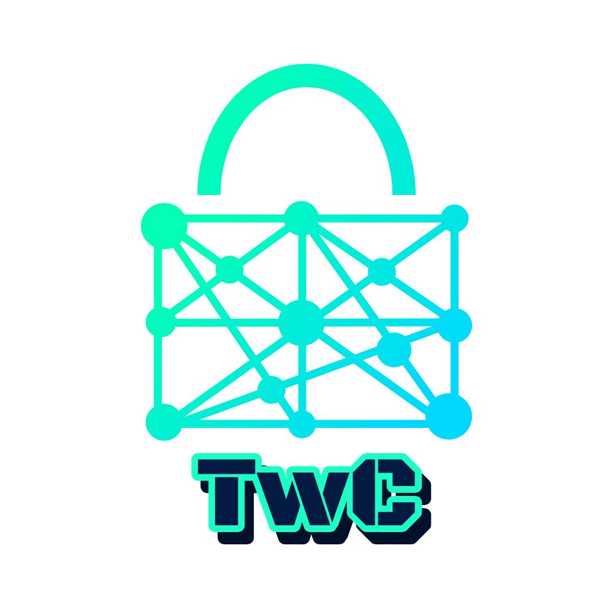

<h1 align="center">FHE Playgrounds  </h1>

### Overview
Fully Homomorphic Encryption (FHE) Playgrounds offer simple challenges and guidelines to get started with FHE applications.

1. [Encrypted Image Filtering](./image-filtering)
2. [Encrypted Sorting](./sorting)
3. [Private Information Retrieval](./pir)
4. [Encrypted Inference](./inference)
5. [Encrypted Aggregation](./aggregation)
6. [Encrypted Functional Units](./functional-units)
7. [Encrypted String Similarity Detection](./string-similarity)

    

<h4 align="center">Trustworthy Computing Group</h4>
